## 单次散射积分实现

<Cards>
  <Card icon={<SiGithub />} href="https://github.com/j1n9h3/Alpha3D/blob/v0.1.6/shaders/sky_atmosphere_1993.frag" title="实现代码 Alpha3D v0.1.6">
    实时大气单次散射 ray-marching 实现，包含 rayleigh 散射、mie 散射与臭氧吸收
  </Card>
  <Card icon={<SiAcm />} href="https://dl.acm.org/doi/abs/10.1145/166117.166140" title="参考论文 Nishita 1993">
Nishita et al. Display of the Earth Taking into Account Atmospheric Scattering. SIGGRAPH, 1993
  </Card>
</Cards>

```glsl title="shaders/sky_atmosphere.frag" tab="计算单散射积分"
// [!code word:rayleigh]
// [!code word:Rayleigh]
// [!code word:mie]
// [!code word:Mie]
// [!code word:absorption]
vec3 CalculateScattering(vec3 rayOrigin, vec3 rayDirection, float maxDistance, 
    vec3 background, vec3 lightDirection) {
    ...
    for (int i = 0; i < PRIMARY_STEPS; ++i) {
        vec3 samplePosition = rayOrigin + rayDirection * rayPosition;
        float height = max(length(samplePosition) - planetRadius, 0.0);
        vec3 localDensity = AtmosphereDensity(height) * stepSize;
        opticalDepth += localDensity;

        vec2 lightHit = RaySphereIntersect(samplePosition, lightDirection, atmosphereRadius);
        float lightStepSize = max(lightHit.y, 0.0) / float(LIGHT_STEPS);
        float lightPosition = lightStepSize * 0.5;
        vec3 lightOpticalDepth = vec3(0.0);

        for (int j = 0; j < LIGHT_STEPS; ++j) {
            vec3 lightSample = samplePosition + lightDirection * lightPosition;
            float lightHeight = max(length(lightSample) - planetRadius, 0.0);
            lightOpticalDepth += AtmosphereDensity(lightHeight) * lightStepSize;
            lightPosition += lightStepSize;
        }

        vec3 combinedDepth = opticalDepth + lightOpticalDepth;
        vec3 attenuation = exp(-rayleighBeta * combinedDepth.x
                               - mieBeta * combinedDepth.y
                               - absorptionBeta * combinedDepth.z);
        totalRayleigh += localDensity.x * attenuation;
        totalMie += localDensity.y * attenuation;
        rayPosition += stepSize;
    }

    vec3 transmittance = exp(-rayleighBeta * opticalDepth.x         
                             - mieBeta * opticalDepth.y             
                             - absorptionBeta * opticalDepth.z);    
    vec3 scatteredLight = (rayleighPhase * rayleighBeta * totalRayleigh     
                         + miePhase * mieBeta * totalMie) * lightIntensity;     
    return scatteredLight + background * transmittance;
}
```


```glsl  title="shaders/sky_atmosphere.frag" tab="获取大气各分子密度"
// [!code word:rayleigh]
// [!code word:Rayleigh]
// [!code word:mie]
// [!code word:Mie]
// [!code word:absorption]
vec3 AtmosphereDensity(float height) {
    vec2 particleDensity = exp(-height / vec2(rayleighHeight, mieHeight));     
    float ozoneOffset = (absorptionHeight - height) / absorptionFalloff;
    float ozoneDensity = particleDensity.x / (ozoneOffset * ozoneOffset + 1.0);
    return vec3(useRayleigh ? particleDensity.x : 0.0, useMie ? particleDensity.y : 0.0, useAbsorption ? ozoneDensity : 0.0);
}
```

### rayleigh 散射

rayleigh 散射由空气中小分子实现，蓝光比红光更容易被散射。

白天，天空蓝光被更多地散射到观察者方向，使天空呈蓝色：

<ImageComparison
  before="/sky_atmosphere/sky_atmosphere_1993_rayleigh-wo-1.png"
  after="/sky_atmosphere/sky_atmosphere_1993_rayleigh-w-1.png"
  beforeAlt="None"
  afterAlt="rayleigh"
  beforeLabel="none"
  afterLabel="+ rayleigh"
  caption="rayleigh 散射效果 白天"
/>

日出和日落时，太阳光经过更长的大气路径，蓝光被大量散射出去，直射太阳光偏橙红色：

<ImageComparison
  before="/sky_atmosphere/sky_atmosphere_1993_rayleigh-wo-2.png"
  after="/sky_atmosphere/sky_atmosphere_1993_rayleigh-w-2.png"
  beforeAlt="None"
  afterAlt="rayleigh"
  beforeLabel="none"
  afterLabel="+ rayleigh"
  caption="rayleigh 散射效果 日落"
/>


### mie 散射

米氏散射通常具有明显的前向散射特征，朝太阳方向观察时会看到更强的亮度和光晕：
  
<ImageComparison
  before="/sky_atmosphere/sky_atmosphere_1993_mie-wo-1.png"
  after="/sky_atmosphere/sky_atmosphere_1993_mie-w-1.png"
  beforeAlt="rayleigh"
  afterAlt="rayleigh + mie"
  beforeLabel="rayleigh"
  afterLabel="rayleigh + mie"
  caption="mie 散射效果"
/>

### 臭氧吸收

臭氧层对绿光吸收最强，对红光次之，对蓝光吸收最弱。

日出、日落时，光在大气中的传播路径变长，臭氧使部分区域呈现更明显的蓝紫色或粉紫色过渡：

<ImageComparison
  before="/sky_atmosphere/sky_atmosphere_1993_absorption-wo-2.png"
  after="/sky_atmosphere/sky_atmosphere_1993_absorption-w-2.png"
  beforeAlt="rayleigh + mie"
  afterAlt="rayleigh + mie + absorption"
  beforeLabel="rayleigh + mie"
  afterLabel="rayleigh + mie + absorption"
  caption="臭氧吸收效果 地面"
  />

从太空观察时，大气分子产生的 rayleigh 散射使行星边缘呈现蓝色光环，臭氧吸收进一步削弱部分红光和绿光：

<ImageComparison
  before="/sky_atmosphere/sky_atmosphere_1993_absorption-wo-1.png"
  after="/sky_atmosphere/sky_atmosphere_1993_absorption-w-1.png"
  beforeAlt="rayleigh + mie"
  afterAlt="rayleigh + mie + absorption"
  beforeLabel="rayleigh + mie"
  afterLabel="rayleigh + mie + absorption"
  caption="臭氧吸收效果 星球"
/>
  
## 查找表加速实现

<Cards>
  <Card icon={<SiGithub />} href="https://github.com/j1n9h3/Alpha3D/blob/v0.1.9/shaders/sky_atmosphere/sky_atmosphere.frag" title="实现代码 Alpha3D v0.1.9">
    实时大气散射快速查找实现，报刊 Sky-View LUT 和 Transmittance LUT 两张查找表
  </Card>
  <Card icon={<SiAcm />} href="https://sebh.github.io/publications/egsr2020.pdf" title="参考论文 Hillaire 2020">
    Hillaire et al. A Scalable and Production Ready Sky and Atmosphere Rendering Technique, 2020
  </Card>
</Cards>

使用查找表加速结果如下（单位 毫秒），其中 primary steps 和 light steps 均设置为 64：

```mermaid
xychart horizontal
x-axis [2k, 1080p, 800x600]
bar [43.7, 22.7, 3.67]
bar [2.551, 1.302, 0.258]
bar [1.103, 0.523, 0.110]
```




- Bar1：由双重积分暴力实现；
- Bar2：在 Bar1 的基础上加入 64 light-steps Transmittance LUT；
- Bar3：在 Bar2 的基础上加上了 Sky-View LUT。


### Transmittance LUT

采样 LUT 的主要流程如下：

```glsl title="shaders/sky_atmosphere.frag" tab="用 LUT 替换光线积分"
vec3 integrateAtmosphereScattering(vec3 rayOrigin, vec3 rayDirection, float maxDistance, vec3 background, vec3 lightDirection) {
	...
	for (int i = 0; i < viewSampleCount; ++i) {
		vec3 samplePosition = rayOrigin + rayDirection * rayPosition;
		float height = max(length(samplePosition) - planetRadius, 0.0);
		vec3 localDensity = AtmosphereDensity(height) * stepSize;
		opticalDepth += localDensity;

		vec2 lightHit = RaySphereIntersect(samplePosition, lightDirection, atmosphereRadius);

		vec3 lightOpticalDepth = vec3(0.0);
		vec3 attenuation = vec3(0.0);

		vec3 viewTransmittance = exp(-rayleighBeta * opticalDepth.x - mieBeta * opticalDepth.y - absorptionBeta * opticalDepth.z);

		if (useTransmittanceLUT) { // [!code ++]
			attenuation = viewTransmittance * SampleTransmittanceLUT(samplePosition, lightDirection); // [!code highlight] 
		} // [!code ++]
		else { 
			attenuation = viewTransmittance * computeTransmittance(samplePosition, lightDirection, lightSampleCount);
		}

		totalRayleigh += localDensity.x * attenuation;
		totalMie += localDensity.y * attenuation;
		rayPosition += stepSize;
	}
}
```


```glsl title="shaders/sky_atmosphere.frag" tab="采样 LUT"
vec3 SampleTransmittanceLUT(vec3 position, vec3 direction) {
    float radius = length(position);
    vec3 upDirection = position / radius;
    float zenithCos = dot(upDirection, direction);
    vec2 uv = transmittanceParamsToUv(radius, zenithCos);
    return texture(transmittanceLUT, uv).rgb;
}
```


```glsl title="shaders/sky_atmosphere.frag" tab="积分参数转 UV"
vec2 transmittanceParamsToUv(float viewRadius, float viewZenithCos) {
    float H = sqrt(max(atmosphereRadius * atmosphereRadius - planetRadius * planetRadius, 0.0));
    float rho = sqrt(max(viewRadius * viewRadius - planetRadius * planetRadius, 0.0));
    float discriminant = viewRadius * viewRadius * (viewZenithCos * viewZenithCos - 1.0) + atmosphereRadius * atmosphereRadius;
    float distanceToTop = -viewRadius * viewZenithCos + sqrt(max(discriminant, 0.0));
    float dMin = atmosphereRadius - viewRadius;
    float dMax = rho + H;
    float xMu = (distanceToTop - dMin) / max(dMax - dMin, 1e-6);
    float xR = rho / max(H, 1e-6);
    return clamp(vec2(xMu, xR), vec2(0.0), vec2(1.0));
}
```

计算 LUT 的主要流程如下：


```glsl  title="shaders/sky_atmosphere.frag" tab="写入 LUT"
vec4 computeTransmittanceLUT() {
    int sampleCount = max(transmittanceLUTSteps, 1);
    float viewHeight;
    float viewZenithCos;
    uvToTransmittanceParams(clamp(screenUV, vec2(0.0), vec2(1.0)), viewHeight, viewZenithCos);
    vec3 assumptionPosition = vec3(0, viewHeight, 0);
    vec3 assumptionDirection = zenithCosToDirection(viewZenithCos, 0);
    return vec4(computeTransmittance(assumptionPosition, assumptionDirection, sampleCount), 1.0);
}
```

```glsl title="shaders/sky_atmosphere.frag" tab="计算光线积分"
vec3 computeTransmittance(vec3 position, vec3 direction, int sampleCount) {
    vec3 upDirection = normalize(position);
    float viewHeight = length(position);
    float viewZenithCos = dot(direction, upDirection);
    float rayLength = RaySphereIntersect(position, direction, atmosphereRadius)[1];
    float stepLength = rayLength / float(sampleCount);
    vec3 opticalDepth = vec3(0.0);

    // The midpoint rule avoids sampling exactly on either spherical boundary.
    for (int i = 0; i < sampleCount; ++i) {
        float distanceAlongRay = (float(i) + 0.5) * stepLength;
        float sampleRadius = sqrt(max(
            viewHeight * viewHeight
            + distanceAlongRay * distanceAlongRay
            + 2.0 * viewHeight * viewZenithCos * distanceAlongRay,
            planetRadius * planetRadius));
        opticalDepth += AtmosphereDensity(sampleRadius - planetRadius) * stepLength;
    }

    vec3 extinction = rayleighBeta * opticalDepth.x
                    + mieBeta * opticalDepth.y
                    + absorptionBeta * opticalDepth.z;
    return exp(-max(extinction, vec3(0.0)));
}
```


```glsl   title="shaders/sky_atmosphere.frag" tab="UV 转积分参数"
void uvToTransmittanceParams(vec2 uv, out float viewHeight, out float viewZenithCos) {
    float H = sqrt(max(atmosphereRadius * atmosphereRadius - planetRadius * planetRadius, 0.0));
    float rho = H * clamp(uv.y, 0.0, 1.0);
    viewHeight = sqrt(rho * rho + planetRadius * planetRadius);
    float dMin = atmosphereRadius - viewHeight;
    float dMax = rho + H;
    float d = mix(dMin, dMax, clamp(uv.x, 0.0, 1.0));
    if (d <= 1e-6) { viewZenithCos = 1.0; return; }
    viewZenithCos = (H * H - rho * rho - d * d) / (2.0 * viewHeight * d);
    viewZenithCos = clamp(viewZenithCos, -1.0, 1.0);
}
```

Transmittance LUT 记录光线积分部分，后续计算 Sky-View LUT 等直接查询，LUT如下：

<OssImage
  src="sky_atmosphere/sky_atmosphere_2020_transmittance_lut.png"
  alt="天空和大气的渲染"
  width={2562}
  height={640}
  caption="Transmittance LUT 纹理"
/>

<Callout title="处理行星遮挡" type="warn">

增加地面遮挡判断，保证日落时地球背对太阳的那一侧天空是黑的，否则会有奇怪的漏光。


```glsl  title="shaders/sky_atmosphere.frag" tab="增加视线与地面求交部分"
for (int i = 0; i < viewSampleCount; ++i) {
    float rayPosition = rayStart + (float(i) + 0.5) * stepSize;
    vec3 samplePosition = rayOrigin + rayDirection * rayPosition;
    float radius = length(samplePosition);
    vec3 localDensity = AtmosphereDensity(max(radius - planetRadius, 0.0)) * stepSize;

    opticalDepth += localDensity;

    float zenithCos = dot(samplePosition / radius, lightDirection);
    vec3 viewTransmittance = exp(-Extinction(opticalDepth));
    vec2 groundHit = RaySphereIntersect(samplePosition, lightDirection, planetRadius); // [!code ++]
    vec3 lightTransmittance = vec3(0.0);
    if (groundHit.y <= 0.0) {  // [!code ++]
        lightTransmittance = useTransmittanceLUT
            ? SampleTransmittanceLUT(radius, zenithCos)
            : transmittance(radius, zenithCos, lightSampleCount);
    } // [!code ++]
    vec3 attenuation = viewTransmittance * lightTransmittance;

    totalRayleigh += localDensity.x * attenuation;
    totalMie += localDensity.y * attenuation;
}
```

```glsl title="shaders/sky_atmosphere.frag"  tab="视线与地面求交细节"
vec2 RaySphereIntersect(vec3 origin, vec3 direction, float radius) {
    float b = 2.0 * dot(direction, origin);
    float c = dot(origin, origin) - radius * radius;
    float discriminant = b * b - 4.0 * c;
    if (discriminant < 0.0) return vec2(1e20, -1e20);
    float root = sqrt(discriminant);
    return vec2((-b - root) * 0.5, (-b + root) * 0.5);
}
```

效果如下：

<ImageComparison
  before="/sky_atmosphere/transLUT-sunset-before.png"
  after="/sky_atmosphere/transLUT-sunset-after.png"
  beforeAlt="None"
  afterAlt="None"
  beforeLabel="before"
  afterLabel="after"
  caption="行星遮挡处理效果对比"
/>

</Callout>

### Sky-View LUT


采样 LUT 的主要流程如下：


```glsl  title="shaders/sky_atmosphere.frag" tab="用 LUT 替换主要积分"
vec3 integrateAtmosphereScattering(vec3 rayOrigin, vec3 rayDirection, float maxDistance, vec3 background, vec3 lightDirection) {
	vec2 atmosphereHit = RaySphereIntersect(rayOrigin, rayDirection, atmosphereRadius);
	if (atmosphereHit.x > atmosphereHit.y) return background;

	float viewHeight = length(rayOrigin);
	if (MODE == 0 && useSkyViewLUT && viewHeight < atmosphereRadius && maxDistance >= 1e20) {  // [!code ++]
		vec3 upVector = normalize(rayOrigin);  // [!code ++]
		float viewZenithCosAngle = dot(rayDirection, upVector);  // [!code ++]
		
		vec3 sideVector = normalize(cross(upVector, rayDirection));  // [!code ++]
		vec3 forwardVector = normalize(cross(sideVector, upVector));  // [!code ++]
		vec2 lightOnPlane = vec2(dot(lightDirection, forwardVector), dot(lightDirection, sideVector));  // [!code ++]
		lightOnPlane = normalize(lightOnPlane);  // [!code ++]
		float lightViewCosAngle = lightOnPlane.x;  // [!code ++]

		vec2 skyViewUV = skyViewLutParamsToUv(viewZenithCosAngle, lightViewCosAngle, viewHeight, false);  // [!code ++]
		vec3 viewTransmittance = useTransmittanceLUT  // [!code ++]
			? SampleTransmittanceLUT(viewHeight, viewZenithCosAngle)  // [!code ++]
			: transmittance(viewHeight, viewZenithCosAngle, max(lightSteps, 1));  // [!code ++]
		return texture(skyViewLUT, skyViewUV).rgb + background * viewTransmittance;  // [!code highlight]
	}  // [!code ++]

	...
   	for (int i = 0; i < viewSampleCount; ++i) {
        ...
    }
}

```


```glsl   title="shaders/sky_atmosphere.frag" tab="积分参数转 UV"
vec2 skyViewLutParamsToUv(float viewZenithCos, float lightViewCos, float viewHeight, bool intersectGround) {
    const float PI = 3.14159265359;
    float horizonDistance = sqrt(max(viewHeight * viewHeight - planetRadius * planetRadius, 0.0));
    float cosBeta = clamp(horizonDistance / viewHeight, 0.0, 1.0);
    float beta = acos(cosBeta);
    float zenithHorizonAngle = PI - beta;
    float viewZenithAngle = acos(clamp(viewZenithCos, -1.0, 1.0));

    float logicalV;
    if (intersectGround || viewZenithAngle >= zenithHorizonAngle) {
        float coord = sqrt(clamp((viewZenithAngle - zenithHorizonAngle) / max(beta, 1e-6), 0.0, 1.0));
        logicalV = 0.5 + 0.5 * coord;
    } else {
        float coord = sqrt(clamp(1.0 - viewZenithAngle / max(zenithHorizonAngle, 1e-6), 0.0, 1.0));
        logicalV = 0.5 * (1.0 - coord);
    }
    float logicalU = sqrt(clamp((1.0 - lightViewCos) * 0.5, 0.0, 1.0));
    return vec2(fromUnitToSubUvs(logicalU, 192.0), fromUnitToSubUvs(1.0 - logicalV, 108.0));
}
```

计算 LUT 的主要流程如下：

```glsl   title="shaders/sky_atmosphere.frag" tab="写入 LUT"
vec4 computeSkyViewLUT()
{
    float viewHeight = clamp(
        planetRadius + cameraHeight + cameraPos.y,
        planetRadius + 1.0,
        atmosphereRadius - 1.0);

    float viewZenithCos;
    float lightViewCos;
    uvToSkyViewParams(viewZenithCos, lightViewCos, viewHeight, screenUV);

    float sunZenithCos = clamp(normalize(lightDirection).y, -1.0, 1.0);
    vec3 sunDirection = normalize(vec3(
        sqrt(max(1.0 - sunZenithCos * sunZenithCos, 0.0)),
        0.0,
        sunZenithCos));

    float viewZenithSin = sqrt(max(1.0 - viewZenithCos * viewZenithCos, 0.0));
    vec3 viewDirection = normalize(vec3(
        viewZenithSin * lightViewCos,
        viewZenithSin * sqrt(max(1.0 - lightViewCos * lightViewCos, 0.0)),
        viewZenithCos));

    vec3 atmosphereCamera = vec3(0.0, 0.0, viewHeight);

    vec2 planetHit = RaySphereIntersect(atmosphereCamera, viewDirection, planetRadius);
    float sceneDepth = 1e20;
    if (planetHit.y > 0.0)
        sceneDepth = max(planetHit.x, 0.0);

    vec3 radiance = integrateAtmosphereScattering(atmosphereCamera, viewDirection, sceneDepth, vec3(0.0), sunDirection);

    return vec4(radiance, 1.0);
}
```


```glsl  title="shaders/sky_atmosphere.frag" tab="UV 转积分参数"
void uvToSkyViewParams(out float viewZenithCos, out float lightViewCos, float viewHeight, vec2 uv) {
    const float PI = 3.14159265359;
    uv = vec2(fromSubUvsToUnit(uv.x, 192.0), fromSubUvsToUnit(uv.y, 108.0));
    uv.y = 1.0 - uv.y;

    float horizonDistance = sqrt(max(viewHeight * viewHeight - planetRadius * planetRadius, 0.0));
    float cosBeta = clamp(horizonDistance / viewHeight, 0.0, 1.0);
    float beta = acos(cosBeta);
    float zenithHorizonAngle = PI - beta;

    if (uv.y < 0.5) {
        float coord = 1.0 - 2.0 * uv.y;
        coord *= coord;
        coord = 1.0 - coord;
        viewZenithCos = cos(zenithHorizonAngle * coord);
    } else {
        float coord = uv.y * 2.0 - 1.0;
        coord *= coord;
        viewZenithCos = cos(zenithHorizonAngle + beta * coord);
    }

    float coord = uv.x;
    coord *= coord;
    lightViewCos = -(coord * 2.0 - 1.0);
}
```


横轴非线性编码视线与太阳的夹角，纵轴以地平线为中心编码视线天顶角，利用大气对称性只覆盖半球，LUT如下：

<OssImage
  src="sky_atmosphere/sky_atmosphere_sky_view_lut_2.png"
  alt="sky_atmosphere_sky_view_lut"
  width={1920}
  height={1080}
  caption="Sky-View LUT 纹理"
/>
